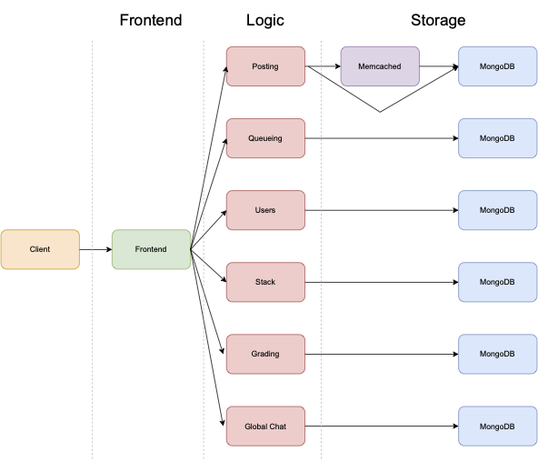

# helpme.out by SAL

A microservice-based application to simplify after-lecture activities. We have developed the queueing, posting, users, stacks, grading, and global chat services.

## Repository Organization

- _services_: application logic and storage services
- _website_: frontend services
- _performance_: performance testing scripts
- _docker_: Dockerfiles
- _utils_: helper scripts for data processing
- _archive_: old versions of frontend services
- _wrk_: workload generator scripts using Locust
- _tracing_: tracing scripts using Jaeger
- _testing_: pytest testing suite

## Available Scripts
 
### `make setup` 

Installs required dependencies.

### `make run`

Runs frontend, Flask services, and memcached.

### `make run-api`

Runs backend Flask services.

### `make run-frontend`

Runs frontend React application.

### `make run-memcached`

Runs memcached.

### `make run-locust`

Runs Locust workload generator tool.

### `make run-jaeger-tracing-container`

Runs Jaeger tracing infrastructure.
