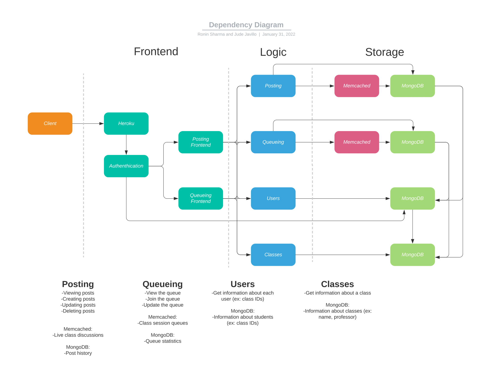

# helpme.out by SAL

A microservice-based application to simplify after-lecture activities. We are currently developing the queueing, posting, users, and classes services.

## Repository Organization

- _wrk_: workload generator scripts using Locust
- _tracing_: tracing scripts using Jaeger
- _services_: application logic and storage services
- _testing_: pytest testing suite
- _website_: frontend services
- _archive_: old versions of frontend services

## Available Scripts
 
### `make setup` 

Installs required dependencies.

### `make run`

Runs frontend, Flask services, and memcached.

### `make run-api`

Runs backend Flask services.

### `make run-frontend`

Runs frontend React application.

### `make run-memcached`

Runs memcached.

### `make run-locust`

Runs Locust workload generator tool.

### `make run-jaeger-tracing-container`

Runs Jaeger tracing infrastructure.
